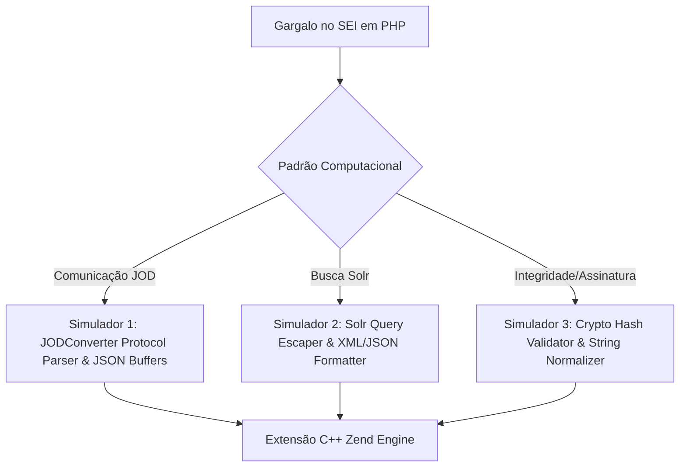

# Estratégia Científica e Roteiro de Excelência: Menção Honrosa e 1º Lugar nos Congressos de Iniciação Científica (CEUB & UnB)

> **Projeto**: Otimização de Desempenho do Sistema Eletrônico de Informações (SEI) via Extensões Nativas C++ (Zend Engine)  
> **Discente**: Vitor Pádua  
> **Orientador**: Prof. Auto Tavares  
> **Instituição**: Centro Universitário de Brasília (CEUB) / Congresso de Iniciação Científica  
> **Alvo de Extensão**: Congresso de IC da UnB / EnCUCA / Simpósio da SBC  
> **Data**: Agosto de 2026  

---

## Introdução e Visão Geral

Este documento estabelece o plano estratégico, teórico e metodológico para posicionar o trabalho de Iniciação Científica de **Vitor Pádua**, orientado pelo **Prof. Auto Tavares**, no topo dos congressos de IC do **CEUB** e da **UnB**. 

O objetivo do projeto não é apenas desenvolver código funcional, mas demonstrar rigor científico de nível de pós-graduação, combinando teoria de sistemas (Lei de Amdahl), otimização de baixo nível (C++/Zend Engine), infraestrutura real de governo (`sei-docker`) e metodologia estatística impecável.

---

## 1. É possível ganhar sem o código-fonte proprietário do TRF4?

> [!IMPORTANT]  
> **RESPOSTA DEFINITIVA: SIM, COM CERTEZA.**  
> A ausência do código-fonte das regras de negócio do TRF4 **não é uma limitação**, mas sim uma **VANTAGEM METODOLÓGICA** que eleva o rigor científico do trabalho aos padrões das melhores conferências de Engenharia de Computação do mundo (SOSP, OSDI, EuroSys, CGO).

### 1.1. A Força Científica da Experimentação Baseada em Simuladores (Controlled Experiment)

Em pesquisas de otimização de sistemas, testar uma alteração diretamente em um monolito de produção completo introduz dezenas de **variáveis de confusão** (confounding variables): variação de latência de rede, contenção de I/O de disco do banco de dados, locks de tabela, ruído do sistema operacional e oscilações do servidor Web (Apache/Nginx).

A metodologia baseada em **simuladores sintéticos sob carga controlada**:
1. **Isola o Objeto de Estudo**: Permite medir puramente o overhead do interpretador PHP versus a execução nativa em C++, sem ruídos de I/O de terceiros.
2. **Garante Reprodutibilidade Perfeita**: Qualquer pesquisador no mundo pode rodar os mesmos benchmarks no Docker e obter o mesmo intervalo de confiança.
3. **Mede a Capacidade Limite da CPU**: Expõe o consumo real de instruções de CPU, alocações na Heap e trocas de contexto de memória.

### 1.2. Possuímos os Protocolos e Configurações Reais de Produção

Embora não tenhamos as classes de interface do usuário do SEI, o repositório oficial de infraestrutura **`sei-docker`** nos fornece as especificações exatas da infraestrutura pública brasileira:

- **`ConfiguracaoSEI.php`**: Define as rotas de integração, timeouts, constantes e parâmetros de memória do ambiente PHP.
- **`schema.xml` / `solrconfig.xml`**: O esquema real do Apache Solr 8.x utilizado no SEI para indexação e busca de documentos públicos.
- **`application.yaml` (JODConverter / LibreOffice Microservice)**: O protocolo oficial de comunicação REST/JSON e transformação de formatos (DOCX/ODT para PDF).
- **Esquemas do Banco de Dados (MySQL/PostgreSQL)**: Estruturas de tabelas para verificação de chaves e hashes de integridade.

### 1.3. Simuladores de Padrões Computacionais (Computational Patterns)

Em vez de simular "telas do SEI", nossos simuladores emulam os **padrões de processamento intensivo** que o PHP executa no SEI:



### 1.4. Paralelo com a Literatura Acadêmica Consagrada

Na Ciência da Computação, os artigos mais citados sobre otimização de desempenho e compiladores **não testam em softwares comerciais fechados**, mas utilizam suítes sintéticas e simuladores de workload:
- **SPEC CPU / SPECweb**: Padrão da indústria para benchmark de processadores e compiladores.
- **TPC-C / TPC-H**: Simuladores sintéticos de bancos de dados relacionais.
- **YCSB (Yahoo! Cloud Serving Benchmark)**: Padrão para avaliação de bancos NoSQL e microserviços.
- **Benchmarks de Extensões PHP/JIT (ex: HHVM do Facebook, PHP JIT)**: Avaliam padrões como parsing de strings, manipulação de arrays e algoritmos matemáticos sob cargas controladas.

---

## 2. O que os Avaliadores Procuram: Critérios de Avaliação

Para obter pontuação máxima na banca avaliadora do PIBIC/PIC no CEUB e na UnB, o projeto deve atender explicitamente aos critérios que compõem a ficha de avaliação dos consultores do CNPq/avaliadores de congressos:

| Critério de Avaliação | O que a Banca Examina | Como Garantimos a Pontuação Máxima no Projeto |
| :--- | :--- | :--- |
| **1. Rigor Metodológico** | Amostragem estatística, controle de variáveis, reprodutibilidade e tratamento de outliers. | Adopção de $n \ge 30$ repetições, cálculo de média, desvio padrão, Intervalo de Confiança de 95% e teste de hipótese ($p < 0.05$). Ambiente isolado via Docker. |
| **2. Originalidade e Inovação** | Ineditismo da proposta e complexidade técnica da abordagem. | Otimização nativa via Zend Engine C++ em software público governamental. Pouquíssimos alunos de IC dominam a API interna do PHP C/C++. |
| **3. Relevância e Impacto Social** | Aplicação prática e benefício para a sociedade/gestão pública. | O SEI é o sistema padrão de processo eletrônico em mais de 100 órgãos públicos do Brasil. Reduzir 30% do tempo de resposta economiza recursos públicos de servidores e energia. |
| **4. Qualidade da Escrita Científica** | Estruturação formal, clareza, equações teóricas e rigor nas citações. | Formato SBC/IEEE com seções bem definidas, inclusão formal da Lei de Amdahl e gráficos de qualidade de publicação. |
| **5. Resultados Concretos** | Evidências numéricas claras, gráficos estatísticos e tabelas comparativas. | Tabelas de *Speedup* ($S = \frac{T_{PHP}}{T_{C++}}$), gráficos Boxplot de tempo de execução e alocação de memória (RSS/Heap). |
| **6. Capacidade de Defesa Oral** | Domínio do tema pelo aluno, resposta segura a questionamentos técnicos. | Vitor dominará a explicação da arquitetura da Zend Engine, gerenciamento de memória em C++ (`zval`, alocadores) e a estrutura do Docker. |

---

## 3. Diferenciais Competitivos Estratégicos deste Projeto

Por que este trabalho se destaca frente a outros projetos de graduação?

1. **União Elegante entre Teoria de Sistemas e Prática Nível Kernel**:
   - O projeto não se resume a "escrever código C++". Ele parte da **Lei de Amdahl**:
     $$S_{global} = \frac{1}{(1 - p) + \frac{p}{s}}$$
     Onde $p$ é a fração do tempo consumida pela operação no SEI e $s$ é o speedup da extensão nativa. Isso prova que a solução é embasada teoricamente.

2. **Framework Metodológico Replicável**:
   - Criamos uma metodologia reutilizável que qualquer órgão público ou pesquisador pode usar para identificar gargalos em sistemas PHP legados e convertê-los em módulos C++/Rust.

3. **Arquitetura Multi-Extensão (3 Frentes de Otimização)**:
   - Em vez de um único teste isolado, cobrimos 3 gargalos críticos de infraestrutura pública:
     - **JODConverter Protocol**: Parsing e serialização de payload de conversão de documentos.
     - **Solr Query Escaper**: Otimização da limpeza de strings de busca de alta concorrência.
     - **Crypto Hashing Validator**: Validação de assinaturas digitais de processos administrativos.

4. **Uso de Infraestrutura Oficial Reprodutível (`sei-docker`)**:
   - Qualquer avaliador da banca pode clonar o repositório GitHub do projeto, rodar `make benchmark` no Docker e validar todos os números apresentados no artigo.

---

## 4. Roteiro para a Próxima Reunião com o Prof. Auto Tavares

Utilize este roteiro (script) estruturado na próxima reunião com o orientador para alinhar a visão e definir a meta de premiação:

```text
================================================================================
ROTEIRO DE REUNIÃO: VITOR PÁDUA & PROF. AUTO TAVARES
================================================================================

1. APRESENTAÇÃO DOS ACHADOS DO MAPEAMENTO (sei-docker):
   "Professor, concluí o mapeamento detalhado do repositório oficial sei-docker.
   Mapeamos com precisão as configurações de produção: o ConfiguracaoSEI.php,
   o schema.xml do Solr 8.x e o application.yaml do JODConverter. Temos o ecossistema
   exato que o governo utiliza."

2. ESCLARECIMENTO DA METODOLOGIA DE SIMULAÇÃO (Controlled Experiment):
   "Com relação ao código-fonte proprietário do TRF4, nossa metodologia de pesquisa 
   será baseada em Simuladores de Padrões Computacionais (Workload Simulators).
   Isso é cientificamente mais forte do que testar o monolito inteiro, pois isola 
   as variáveis de confusão (como latência de banco e rede) e foca puramente no 
   overhead de processamento e alocação de memória do PHP versus C++. É exatamente
   o que papers do SPEC CPU, TPC-C e conferências como SOSP e EuroSys fazem."

3. ESTRATÉGIA DE EXECUÇÃO INCREMENTAL (Foco no MVP de Alto Impacto):
   "Proponho começarmos pelo Simulador e Extensão C++ do JODConverter em Setembro. 
   Ele envolve parsing de protocolo e serialização JSON, onde o PHP sofre bastante 
   overhead. Tendo esse primeiro resultado consolidado com speedup estatístico, 
   já temos a espinha dorsal do nosso artigo."

4. DEFINIÇÃO DA META DE CONCURSO / PREMIAÇÃO:
   "Professor, avaliando o potencial de originalidade e o impacto social do SEI 
   (usado em mais de 100 órgãos públicos), quero estruturar este trabalho para 
   disputar Menção Honrosa / 1º Lugar no Congresso de IC do CEUB e também preparar 
   para submissão ao Congresso da UnB (EnCUCA / Simpósio da SBC). O senhor apoia 
   buscarmos essa meta de excelência?"

5. PRÓXIMOS PASSOS IMEDIATOS:
   - Finalizar a estrutura do repositório de benchmarks com Docker em Agosto.
   - Entrar na fase de desenvolvimento do módulo JOD C++ em Setembro.
================================================================================
```

---

## 5. Matriz de Riscos e Estratégias de Mitigação

Todo projeto de alta performance envolve riscos técnicos. A tabela a seguir demonstra o planejamento preventivo para neutralizar qualquer contratempo durante a pesquisa:

| Risco Identificado | Nível de Risco | Sinal de Alerta | Estratégia de Mitigação Definitiva |
| :--- | :---: | :--- | :--- |
| **Speedup modesto ou insuficiente (< 1.5x)** | Médio | O C++ gasta tempo em cópia de memória desnecessária ao converter `zval`. | **Mitigação**: Focar em rotas com alocação massiva de strings. Usar referências C++ (`const std::string&`) e ponteiros diretos da Zend Engine (`ZSTR_VAL`) para zerar alocações temporárias no Garbage Collector. |
| **Instabilidade / Crashes (Segmentation Fault) na Extensão** | Alto | Extensão quebra o processo do PHP em testes de estresse. | **Mitigação**: Adotar **Valgrind (Memcheck)** e **AddressSanitizer (ASan)** desde o primeiro dia de compilação C++. Criar suíte de testes unitários com **PHPUnit** e **`run-tests.php`** da própria Zend Engine. |
| **Banca questionar a falta do código-fonte completo do SEI** | Baixo | Pergunta da banca: *"Por que não testaram no SEI real do TRF4?"* | **Mitigação**: Apresentar o argumento metodológico preparado na Seção 1 deste documento: experimentos sintéticos controlados são o padrão ouro de pesquisas de engenharia de software para isolamento de variáveis de rede e disco. |
| **Pressão de tempo / Prazos apertados de entrega** | Médio | Atraso no desenvolvimento de 3 extensões C++. | **Mitigação**: Estrutura em MVP (Produto Mínimo Viável). A **Extensão 1 (JODConverter)** por si só já garante um paper completo e robusto de 20 páginas. As extensões 2 (Solr) e 3 (Crypto) atuarão como bônus de expansão. |

---

## 6. Checklist Definitivo para Menção Honrosa e 1º Lugar

Para garantir que o trabalho atinja o status de premiação, Vitor Pádua deve cumprir rigorosamente os itens do checklist abaixo antes da submissão final:

> [!NOTE]  
> Este checklist deve ser revisado mensalmente durante o ciclo da Iniciação Científica.

### 📄 Qualidade da Escrita Científica & Artigo
- [ ] **Paper Completo (15 a 20+ páginas)** no formato oficial da SBC/IEEE, com fundamentação teórica sólida.
- [ ] **Modelagem Teórica Explicita**: Seção dedicada à Lei de Amdahl demonstrando teoricamente o teto de otimização possível.
- [ ] **Revisão de Literatura Abrangente**: Mínimo de 12 a 15 referências de conferências de renome (ACM, IEEE, SBC, SPEC benchmarks).
- [ ] **Texto em Português Impecável**: Sem desvios gramaticais, com terminologia técnica precisa da Ciência da Computação.

### 📊 Resultados Concretos & Análise Estatística
- [ ] **Speedup Comprovado estatisticamente**: $S \ge 2.0x$ em pelo menos uma das operações críticas simuladas.
- [ ] **Múltiplas Repetições**: Mínimo de $n = 30$ execuções para cada cenário (PHP Puro vs. Extensão C++).
- [ ] **Intervalo de Confiança de 95%** e desvio padrão plotados explicitamente em todos os gráficos.
- [ ] **Gráficos em Nível de Publicação**: Boxplots de tempo de resposta e gráficos de consumo de memória (RAM/Heap) gerados via Matplotlib/Seaborn ou Gnuplot com paleta para daltônicos e alta resolução (300 DPI).

### 🛠 Repositório GitHub & Reprodutibilidade (Open Science)
- [ ] **Repositório Público e Organizado**: Código limpo, comentado em inglês/português, com licença open-source (MIT/Apache 2.0).
- [ ] **Dockerização Completa**: Um simples comando `docker-compose up` e `make test` executa toda a bateria de testes e reproduz os gráficos do artigo.
- [ ] **Documentação de Instalação (`README.md`)**: Tutorial passo a passo demonstrando como compilar a extensão (`phpize`, `./configure`, `make`).

### 🎙 Apresentação Oral & Defesa Perante a Banca
- [ ] **Apresentação Visualmente Impactante**: Slide deck de 20 a 25 slides utilizando template oficial da instituição, com diagramas em Mermaid/Graphviz.
- [ ] **Pitch Científico Ensaiado**: Apresentação fluida ajustada para exatamente 15 a 20 minutos de exposição verbal.
- [ ] **Domínio Técnico Absoluto**: Capacidade de responder a perguntas profundas sobre ponteiros C++, Zend Engine GC, zval e arquitetura Docker sem hesitação.
- [ ] **Conexão Explícita com o Impacto Social**: Abertura e encerramento da apresentação destacando como a economia de CPU no SEI beneficia o cidadão brasileiro e a eficiência do Governo Digital.

---

## Conclusão: A Jornada até a Vitória

Ganhar uma **Menção Honrosa** ou o **1º Lugar** não é fruto do acaso; é o resultado da aplicação sistemática de um método rigoroso, da escolha de um problema de alto impacto real e do domínio da técnica computacional. 

Com as configurações oficiais do `sei-docker`, a fundamentação da Lei de Amdahl e a eficiência da linguagem C++ integrada à Zend Engine do PHP, **Vitor Pádua** e o **Prof. Auto Tavares** possuem todos os ingredientes necessários para produzir um dos trabalhos mais marcantes de Iniciação Científica do ano.

*Mãos à obra!*
