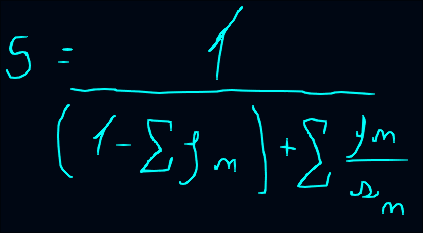
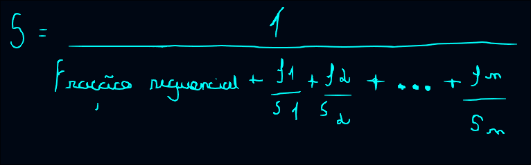
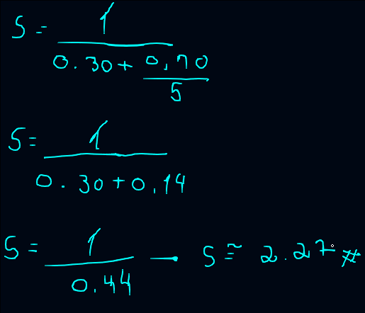
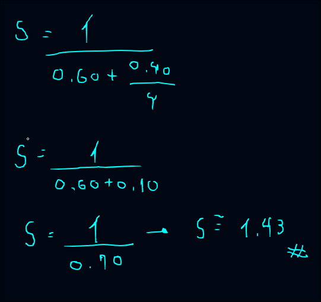
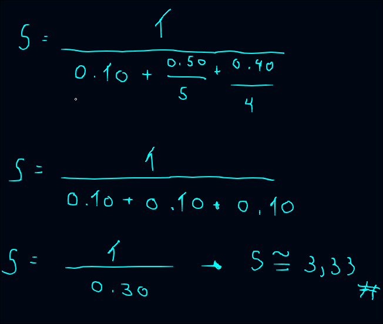

## *Termos*

`Speedup`: Limite teórico de ganho de desempenho, o speedup sempre faz ***Tempo Antigo / Tempo novo***.

`𝒇`: Fração total de execução, ou seja, ***Tempo Sequencial + Tempo Modificável***.

`𝑠`: Fator de aceleração antigido especificamente para ganho de desempenho (speedup).

`1-𝒇`: Fração sequencial que não pode ser alterada sempre deve ser feito ***Tempo Sequencial / Tempo Total***.

`𝒇/𝑠`: Fração modificável que pode ser melhorada dividindo também pelo tempo total ***Tempo Modificável / Tempo Total***.

`𝑺 = 𝟏/(𝟏 - 𝒇) + 𝒇/𝒔`: Fórmula da lei de amdahl.

## *Lei de amdahl*

A lei de amdahl estabelece o limite teórico de ganho de desempenho(speedup) ao otimizar apenas uma parte do sistema, onde 𝒇 é a fração total de execução e 𝑠 é o fator de aceleração atingido especificamente nessa parte.

**Na lei de amdahl as frações sempre são expressas em porcentagens (valores decimais de 0 a 1).**

$$S = \frac{1}{(1 - f) + \frac{f}{s}}$$

  

Exemplo: *Yara vai de metrô para faculdade demorando cerca de 1h30. Quando ela sai do metrô ainda precisa ir caminhando, oque demora mais 20 minutos. Como podemos melhorar o tempo para a yara chegar na faculdade mais rápido?* 

Podemos aplicar a lei de amdahl no exemplo acima de uma forma bem fácil:

1. 1h30 que seria 90 minutos é a fração sequencial do problema pois não se pode aumentar a velocidade de um metrô ir de um ponto A até um ponto B.
2. 20 minutos caminhando seria nossa fração modificável, pois podemos aumentar a eficâcia dessa parte do trajeto.

Por exemplo, ao invês de ir caminhando na parte final do trajeto, ela decidiu ir usando uma bicicleta que diminuiu o tempo de 20 minutos para 10 minutos. Logo podemos dividir o valor de cada coisa da seguinte forma: 

*𝒇 = 110 minutos (90 min + 20 min)*: Fração total de execução, ou seja, o tempo total original sem ganhos.

*𝑠 = 2 (20 min / 10 min)*: Representa o quanto a fração modificável(20) ganhou de desempenho.

*1-𝒇 = 0,8182 (90 min / 110 min)*: Fração sequencial que representa a parte imútavel(não pode mudar).

*𝒇/𝑠 = 0,1818 (20 min / 110 min)*: Fração modificável sobre o quanto de desempenho foi extraido a partir dessa aceleração.

Veja o cálculo passo a passo aplicado à fórmula:

$$S = \frac{1}{(1 - 0.1818) + \frac{0.1818}{2}}$$

$$S = \frac{1}{0.8182 + 0.0909}$$

$$S = \frac{1}{0.9091} \approx 1.10$$

  

Com isso podemos concluir que o ganho de desempenho na rotina foi de **≅ 1.10x** e o maior gargalo continua sendo o **Tempo sequencial (Metrô)**. A lei de amdahl nos ajudou a concluir que o maior problema na rotina especificada é o metrô e podemos apenas melhorar **18.18% (0.1818)** dela.

## *Lei de amdahl para múltiplas otimizações*

A lei de amdahl clássica é limitada porque assume que estamos aplicando melhorias em apenas uma rotina por vez. No entanto, em sistemas reais o foco geralmente é otimizar múltiplos módulos independentes de forma simultânea.

Para entender melhor a fórmula nesse cenário, pense no tempo total que um aplicativo mobile leva para iniciar e carregar a tela do usuário, que é dividido em três etapas:

**Verificação de segurança e permissões de sistema**: 10 segundos (1-𝒇, etapa sequencial não tem como mudar).

**Download e processamento de dados da API**: 50 segundos (fração modificável 1, 𝒇).

**Renderização dos elementos gráficos da interface** 40 segundos (fração modificável 2, 𝒇).

Se a equipe de desenvolvimento aplicar uma otimização no servidor que deixa a busca da API **5x mais rápida** e reescrever o código de UI que deixa a renderização gráfica **4x mais rápida**, a verificação de segurança inicial vai continuar demorando os 10 segundos. Para calcular o ganho real de velocidade do aplicativo inteiro, precisamos somar os novos tempos reduzidos de cada etapa.

Matematicamente, expandimos o denominador da fórmula para acomodar todas as frações modificáveis (𝒇):

$$S_{\text{global}} = \frac{1}{(1 - \sum f_n) + \sum \frac{f_n}{s_n}}$$

  

Para o nosso cenário que contém múltiplos módulos a fórmula estruturada ficaria assim:

$$S_{\text{global}} = \frac{1}{\text{Fração Sequencial} + \frac{f_1}{s_1} + \frac{f_2}{s_2} + \dots + \frac{f_n}{s_n}}$$

  

Onde:

***Fração Sequencial***: Porcentagem restante de tempo do sistema que não sofreu nenhuma alteração (1 - 𝒇₁ - 𝒇₂ - …).

***𝒇₁, 𝒇₂, …𝒇n***: Frações de tempos originais pertencentes a cada um dos módulos. 

***𝒔₁, 𝒔₂, …𝒔n***: Acelerações locais obtidas a partir de cada rotina isolada.

Essa abordagem estendida permite mapear com precisão o impacto obtido com vários módulos simultâneos, mostrando que o teto de desempenho global ainda será ditado pelo pedaço de tempo que não pode ser acelerado.

## *Testes Simulados*

Agora que entendemos como a lei de amdahl, vamos simular a pesquisa ciéntifica para medir o quanto de ganho vai ter em cada rotina específica de cada módulo que o projeto vai ter. 

### *1. Criptografia*

Foi identificado por ferramentas de análise que a criptografia é o maior gargalo atual em questão de desempenho ocupando cerca de **70% do tempo total de execução**. Conseguimos uma aplicação que deixou a rotina* **5x** mais rápida:

**`Fração modificável (𝒇)`: 0,70**

**`Fator de aceleração (𝑠)`: 5**

**`Fração sequencial (1-𝒇)`: 0,30**

Fórmula aplicada:

$$S = \frac{1}{(1 - 0.70) + \frac{0.70}{5}}$$

$$S = \frac{1}{0.30 + 0.14}$$

$$S = \frac{1}{0.44} \approx 2.27$$

  

Com isso temos que o ganho de desempenho do sistema global foi de **≅ 2.27x**.
Mesmo acelerando o maior gargalo (criptografia) em **5x** o sistema como um todo so ganhou **2.27x**, pois os 30% de tempo sequencial seguraram o desempenho.

### *2. JOD*

Este cenário analisa o impacto de otimizar o módulo JOD. Ele possui o menor peso no sistema, sendo responsável por **40% do tempo total de execução**. O ganho de desempenho aplicada a rotina do JOD foi de **4x**:

**`Fração modificável (𝒇)`: 0,40**

**`Fator de aceleração (𝑠)`: 4**

**`Fração sequencial (1-𝒇)`: 0,60**

Fórmula aplicada:

$$S = \frac{1}{(1 - 0.40) + \frac{0.40}{4}}$$

$$S = \frac{1}{0.60 + 0.10}$$

$$S = \frac{1}{0.70} \approx 1.43$$

  

Aqui o ganho de desempenho sobre o sistema global de **≅ 1.43x** ja que o maior ocupação sobre o tempo total de execução é o tempo sequencial, ou seja, o desempenho tende a ser menor naturalmente mesmo com uma aceleração de **4x**.

### *3. Cenário aplicado*

Aqui medimos o impacto global de aplicar as duas otimizações (*Criptografia e JOD*) juntas no mesmo sistema. Para este cálculo, as frações de tempo foram ajustadas para que a soma total feche em 100%. Será avaliado o ganho rodando a criptografia **5x** mais rápido e o módulo JOD **4x** mais rápido ao mesmo tempo: 

***Fração Criptografia (𝒇₁)***: 0.50
***Fração de aceleração criptografia (𝒔₁)***: 5
***Fração JOD (𝒇₂)***: 0.40
***Fração de aceleração JOD (𝒔₂)***: 4
***Fração sequencial restante (1 - 𝒇₁ - 𝒇₂)***: 0.10

Fórmula aplicada: 

$$S = \frac{1}{0.10 + \frac{0.50}{5} + \frac{0.40}{4}}$$

$$S = \frac{1}{0.10 + 0.10 + 0.10}$$

$$S = \frac{1}{0.30} \approx 3.33$$

  

Com isso, temos que o ganho de desempenho sobre o sistema global foi de **≅ 3.33x**. 
O cenário demonstra o limite da Lei de Amdahl: mesmo reduzindo o tempo de execução da criptografia e do JOD para apenas 10% do tempo original cada, a fração sequencial restante de 10% é um gargalo, travando a aceleração global máxima em 3.33x.