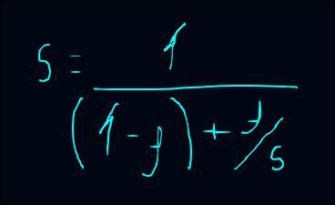
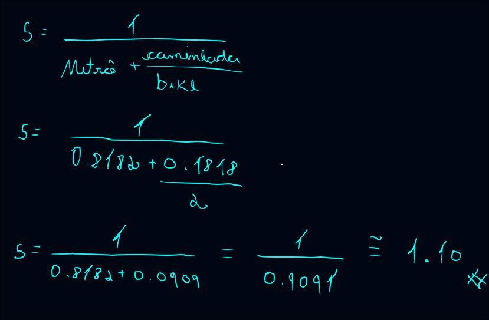

## *Termos*

`Speedup`: Limite teórico de ganho de desempenho, o speedup sempre faz ***Tempo Antigo / Tempo novo***.

`𝒇`: Fração total de execução, ou seja, ***Tempo Sequencial + Tempo Modificável***.

`𝑠`: Fator de aceleração antigido especificamente para ganho de desempenho(speedup).

`1-𝒇`: Fração sequencial que não pode ser alterada sempre deve ser feito ***Tempo Sequencial / Tempo Total***.

`𝒇/𝑠`: Fração modificável que pode ser melhorada dividindo também pelo tempo total ***Tempo Modificável / Tempo Total***.

`𝑺 = 𝟏/(𝟏 - 𝒇) + 𝒇/𝒔`: Fórmula da lei de amdahl.

## *Lei de amdahl*

A lei de amdahl estabelece o limite teórico de ganho de desempenho(speedup) ao otimizar apenas uma parte do sistema, onde 𝒇 é a fração total de execução e 𝑠 é o fator de aceleração atingido especificamente nessa parte.

**Na lei de amdahl as frações sempre são expressas em porcentagens(valores decimais de 0 a 1).**

$$S = \frac{1}{(1 - f) + \frac{f}{s}}$$

  

Exemplo: *Yara vai de metrô para faculdade demorando cerca de 1h30. Quando ela sai do metrô ainda precisa ir caminhando, oque demora mais 20 minutos. Como podemos melhorar o tempo para a yara chegar na faculdade mais rápido?* 

Podemos aplicar a lei de amdahl no exemplo acima de uma forma bem fácil:

1. 1h30 que seria 90 minutos é a fração sequencial do problema pois não se pode aumentar a velocidade de um metrô ir de um ponto A até um ponto B.
2. 20 minutos caminhando seria nossa fração modificável, pois podemos aumentar a eficâcia dessa parte do trajeto.

Por exemplo, ao invês de ir caminhando na parte final do trajeto, ela decidiu ir usando uma bicicleta que diminuiu o tempo de 20 minutos para 10 minutos. Logo podemos dividir o valor de cada coisa da seguinte forma: 

*𝒇 = 110 minutos(90 min + 20 min)*: Fração total de execução, ou seja, o tempo total original sem ganhos.

*𝑠 = 2(20 min / 10 min)*: Representa o quanto a fração modificável(20) ganhou de desempenho.

*1-𝒇 = 0,8182(90 min / 110 min)*: Fração sequencial que representa a parte imútavel(não pode mudar).

*𝒇/𝑠 = 0,1818(20 min / 110 min)*: Fração modificável sobre o quanto de desempenho foi extraido a partir dessa aceleração.

Veja o cálculo passo a passo aplicado à fórmula:

$$S = \frac{1}{(1 - 0.1818) + \frac{0.1818}{2}}$$

$$S = \frac{1}{0.8182 + 0.0909}$$

$$S = \frac{1}{0.9091} \approx 1.10$$

  

Com isso podemos concluir que o ganho de desempenho na rotina foi de **≅ 1.10x** e o maior gargalo continua sendo o **Tempo sequencial (Metrô)**. A lei de amdahl nos ajudou a concluir que o maior problema na rotina especificada é o metrô e podemos apenas melhorar **18.18% (0.1818)** dela.

## *Testes Simulados*

Agora que entendemos como a lei de amdahl, vamos simular a pesquisa ciéntifica para medir o quanto de ganho vai ter em cada rotina especifíca de cada módulo que o projeto vai ter. 

### *1. Criptografia*

Foi identificado por ferramentas de análise que a criptografia é o maior gargalo atual em questão de desempenho ocupando cerca de **70% do tempo total de execução**. Conseguimos uma aplicação que deixou a rotina* **5x** mais rápida:

**`Fração modificável(𝒇)`: 0,70**

**`Fator de aceleração(𝑠)`: 5**

**`Fração sequencial(1-𝒇)`: 0,30**

Fórmula aplicada:

### *2. JOD*

Este cenário analisa o impacto de otimizar o módulo JOD. Ele possui o menor peso menor sistema, sendo responsável por **40% do tempo total de execução**. O ganho de desempenho aplicada nessa rotina isolada foi de **4x**:

**`Fração modificável(𝒇)`: 0,40**

**`Fator de aceleração(𝑠)`: 4**

**`Fração sequencial(1-𝒇)`: 0,60**

Fórmula aplicada:

### *3. Cenário aplicado*

Aqui medimos o impacto global de aplicar as duas otimizações(*Criptografia e JOD*) juntas no mesmo sistema. Para este cálculo, as frações de tempo foram ajustadas para que a soma total feche em 100%. Será avaliado o ganho rodando a criptografia **5x** mais rápido e o módulo JOD **4x** mais rápido ao mesmo tempo: 

Fórmula aplicada: 

